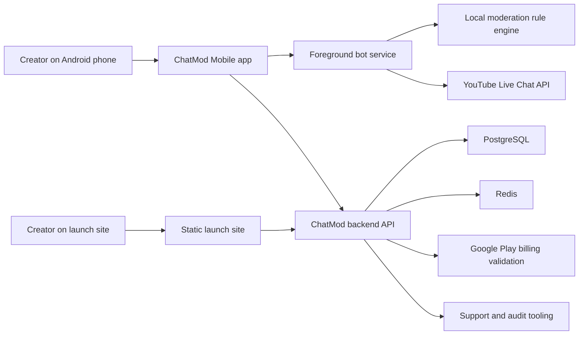

# ChatMod Mobile Architecture

## System Overview

## Product Boundary

The phone hosts the active bot runtime. The backend does not run the live bot for the creator unless a later Pro feature explicitly adds cloud hosting. This keeps the product differentiated from generic hosted chat bots and helps the creator keep their custom bot identity.

## Android Runtime

- Jetpack Compose app shell for live control.
- Foreground service for active stream moderation.
- Local rule engine for fast moderation decisions.
- YouTube client interface for live chat discovery, polling, message sending, deletion, and user hide actions.
- Repository layer for backend session, entitlement, and profile backup.
- Room local database for commands, timers, chat message logs, moderation logs, bot runtime events, and pending sync jobs.
- DataStore settings for selected profile and live-control modes.
- Dashboard Rules tab includes a backend-backed channel profile selector. The selected profile is persisted in DataStore and scopes rule presets, warning history, Discord webhook settings, cloud analytics, settings backup/restore flows, command/timer editor storage, backend command/timer sync writes, and foreground runtime command/timer reads.
- Settings dashboard UI exposes DataStore-backed emergency mode, link lockdown, reduced motion, low-data mode, selected-profile state, and Discord alert controls for webhook save/delete/test plus moderation/runtime toggles.
- Settings dashboard UI also exposes Pro/Creator team access controls for creating profile-scoped invite codes, redeeming moderator invites, listing active memberships, and revoking team access.
- Settings includes an opt-in usage analytics toggle; the Android reporter sends only small validated product events through the backend.
- Android Play Billing uses Google Play Billing Library 8.3.0 through `PlayBillingManager` for product queries, purchase launch, purchase restore, pending-purchase state, and acknowledgement. The dashboard only updates paid entitlement after the backend validates the Play purchase token.
- Dashboard stream selector calls the backend YouTube account-status and broadcast discovery APIs, shows active/scheduled YouTube streams, auto-binds one active live chat when available, blocks connected-channel mismatches before discovery, surfaces no-active-chat and multi-active-stream states, persists the selected active stream, and blocks bot start when no live chat ID is selected.
- Dashboard test connection action sends a validated message through the backend YouTube adapter before the creator starts the bot.
- Dashboard moderator permission check deletes the last test message through the backend YouTube delete route, separating chat write access from moderation-action readiness during setup.
- Low-data mode is stored in DataStore and lengthens foreground-service polling delays when enabled.
- Live Feed, User History, and Logs dashboard UI observe Room-backed chat messages, moderation logs, and bot runtime events.
- Command runtime for aliases, access levels, variables, and cooldown checks.
- Manual command sends use an authenticated backend command route that fetches the account-scoped command, renders it with creator-owned context, validates live-chat text limits, and sends it to the selected YouTube live chat; Android exposes this from each enabled command row.
- Backend and Android rule engines share the same moderation profile contract for blocked terms, regex patterns, link/domain policy, caps, repeated characters, emoji spam, mention spam, and trusted owner/mod/member bypass.
- The Google YouTube live-chat adapter carries verified-author metadata through the backend and Android client; verified authors and whitelisted channel IDs bypass both rule evaluation and local raid/flood abuse tracking.
- Rule profiles include an opt-in deterministic auto-reply action with creator-written text. Android validates and rate-limits the reply before sending it through the backend YouTube live-chat route, and stream-session audit sync accepts the `sendAutoReply` action type.
- Rule profiles include an opt-in severe-match auto-hide switch. High-confidence delete rules can also emit a `hideUser` action, Android executes it through the YouTube hide-user route, and trusted owner/mod/verified/whitelisted users bypass it before evaluation.
- Rule profiles can be scoped to the first N stream minutes with `firstStreamMinutesOnly`; Android supplies stream-start context from the foreground runtime, and backend evaluation accepts `streamStartedAt` for parity.
- Android runtime moderation also tracks repeated-message spam and message floods per chatter, while respecting permanent and temporary trusted-channel bypasses from the active preset.
- Timer runtime for interval and chat-activity scheduling.
- Foreground bot service exposes notification actions for stop, emergency mode, and link lockdown, listens for network changes, pauses polling while offline, emits heartbeat events, and schedules capped reconnect retries after runtime failures.
- Foreground bot service sends non-blocking Discord moderation alerts after successful bot actions using count-only metadata, so webhook delivery cannot slow YouTube polling and chat text is not sent to Discord.
- Outside demo mode, the foreground bot service uses the backend YouTube live-chat runtime endpoints for polling messages, sending command/timer replies, deleting messages, and issuing direct hide/temporary-timeout actions with stored OAuth tokens.
- Dashboard stream setup separates ready, syncing, reconnecting, network-offline, and hard-failure states so creators can tell temporary recovery apart from account or backend issues.
- The active runtime moderation profile responds to DataStore-backed emergency mode and link lockdown: emergency mode tightens spam thresholds, can temporarily time out repeat/flood spammers in raid posture, and pauses timers, while link lockdown forces live-chat links to delete.
- The dashboard caches the selected/default rule preset in DataStore, and the foreground service watches that cached preset so permanent and temporary trusted-channel entries can affect local moderation without a network call during each poll.
- The service holds a guarded partial wake lock only while the bot loop is active, renewing it with heartbeat cadence and releasing it during teardown.
- Runtime start records a battery-optimization warning event when Android has not exempted the app.
- Active bot runtime context is persisted in DataStore and reused when Android restarts the sticky foreground service after process loss.
- The dashboard also observes that active runtime context and requests foreground-service recovery when the app opens with a saved live session but no in-memory running state.
- Service teardown uses the application background scope to record a stopped event and end the backend stream session when possible.
- The bot coordinator propagates live-chat-ended signals so the foreground service can stop, clear runtime state, and queue backend session closure.
- Dashboard command/timer editor changes, including bulk timer pause/resume state, flow through a store abstraction with Room local persistence and a backend-sync wrapper.
- The foreground bot loop reads enabled commands and timers from Room on each poll, carries command cooldown state between polls, persists timer sent timestamps through the timer DAO, passes stream-relative quiet windows into the scheduler, and passes the current emergency-mode flag into the coordinator so timers pause during emergency handling.
- Android data layer has HTTP/demo source wiring for rule preset template/list/save/delete, and the Rules tab can apply curated templates, save a custom preset copy, and switch the backend default preset.
- Queue quick-block actions extract a compact phrase from a selected message, append it to the selected/default moderation preset's blocked terms, save that preset through the backend rule-preset API, and clear the handled queue item locally.
- Queue delete actions call the backend YouTube live-chat message delete route for rows with a YouTube message ID and clear the handled queue item locally after the adapter succeeds.
- Queue warning actions call the backend user-profile warning API, record a strike for the chatter, retain the latest profile image URL when available, optionally send a compact live-chat warning message, and clear the handled queue item locally.
- Users tab combines local chat history with backend warning history, including warned chatter channel IDs, profile images, strike counts, and recent strike reasons.
- Warned-user profile drawer exposes profile details, avatar fallback states, and saves moderator notes through the backend user-profile notes API.
- Warned-user profile drawer can call the backend hide-user route to permanently hide/ban a chatter from the selected YouTube Live chat where the YouTube API permits it.
- Warned-user profile drawer can call the backend timeout route to temporarily ban a chatter from the selected YouTube Live chat where the YouTube API permits it.
- Successful profile hide/timeout calls append backend `UserModerationAction` history with any returned YouTube `liveChatBanId`, which the Android profile drawer and account export can read.
- Profile unban calls delete the saved YouTube live-chat ban id where supported and append an audited `unbanUser` history item.
- Warned-user profile drawer can quick-whitelist a chatter by creating a backend whitelist entry and adding the channel ID to the active/default rule preset's trusted IDs.
- Warned-user profile drawer can save a one-hour temporary whitelist entry with server-generated `temporaryUntil` and add a matching expiring trusted-channel entry to the active/default rule preset without mutating permanent trusted IDs.
- Android data layer has HTTP/demo source wiring for stream-session log sync, and the foreground runtime posts chat messages, rule-match moderation actions, manual moderation actions, and bot runtime events including heartbeat/reconnect events to that backend audit path. Emulator/device verification and UI review flows still need follow-through.
- Android Live Feed and Logs tab classify known rule-engine reasons as `Rule match` entries, with a dedicated Rules filter and rule-match count.
- Completed bot session summaries include `topTriggeredRulesJson`, and the Android Logs tab ranks top triggered rules from local rule-match entries without a paid analytics SDK.
- Rule-match log entries created by `flagForReview` actions are tagged as review candidates so the Android Logs tab can show a false-positive review list.
- Logs tab session summaries count distinct timed-out/hidden users from moderation action metadata, and manual profile timeout/hide actions write into the active stream-session log when a runtime session is available.
- Logs tab local analytics cards rank active chatters, command usage, rule effectiveness, recent spam-attempt buckets, and uptime/reconnect history from Room-backed entries and runtime metadata without requiring cloud analytics infrastructure.
- Backend cross-stream stream-session analytics summarize synced audit logs for top chatters, command usage, rule effectiveness by rule and preset/version, spam attempts by day, and uptime/reconnect history; Android has HTTP/demo source wiring and a Logs tab `Pro trends` card for that account-scoped summary without a paid analytics warehouse.
- Backend OBS/browser overlays reuse synced stream-session audit logs to serve tokenized public HTML and JSON state for OBS browser sources, with recent chat text hidden by default and no paid overlay provider.
- Backend team access uses profile-scoped invite codes and active membership rows so Pro/Creator creators can add and revoke moderator devices without a paid workspace or realtime database.
- Room includes a pending cloud-sync queue for stream session boundaries and runtime/audit writes, with retry backoff and local wipe coverage.
- AndroidX WorkManager schedules connected, battery-aware pending-sync drains for non-live background recovery using the existing Room-backed queue.
- Android backend device sessions are cached in memory, refreshed before expiry, and retried once after stale-token `401` responses in dashboard, command/timer sync, and pending cloud-sync paths.
- Android checks the backend app compatibility contract on dashboard startup, surfaces version health in Settings, and blocks live bot start if the build is below the supported floor.
- Dashboard live status surfaces bot health using selected live-chat readiness, sync state, queue depth, and recent YouTube quota/rate-limit API errors loaded from the support diagnostics API.
- Android stores one sanitized pending crash marker after an uncaught exception and uploads it as a support event on the next launch without a paid crash SDK.
- Android Support tab has a first-party beta feedback form backed by authenticated backend routes.
- The static launch site posts public beta interest to the backend support-event path without adding a paid form provider or separate database.
- Optional `/admin/*` support routes are registered only when `ADMIN_API_KEY` is configured, giving free-tier beta support user/device lookup, subscription lookup, manual entitlement adjustment, and support ticket metadata without a paid helpdesk backend. The static dashboard in `launch-site/admin.html` uses those routes without adding a paid admin UI service.

## Backend Runtime

- Fastify API.
- Signed device session tokens.
- Protected routes for profiles, entitlement, backups, commands, timers, logs, YouTube setup, and moderation evaluation.
- Runtime YouTube routes expose authenticated live-chat message polling, runtime message send, message delete, and direct hide/temporary-timeout actions so the Android phone can host the bot while the backend safely owns encrypted OAuth token custody.
- Google Play billing validation service for backend-trusted entitlement updates.
- Entitlement snapshots enforce active, trialing, grace, canceled-until-expiry, and expired access rules.
- Entitlement limits are enforced on backend channel-profile, custom-command, timed-message, and settings-restore paths so the Starter plan is a real product boundary, not just UI copy. Active Pro/Creator plans use `null` command/timer limits to mean uncapped usage, which quota checks allow and Android labels as Unlimited.
- Advanced moderation filters are entitlement-gated on backend rule-preset save and moderation evaluation, keeping Starter on basic filters while Pro/Creator can use regex, domain lists, member bypass, symbol/emoji/mention thresholds, and raid/new-chatter controls.
- Google YouTube API adapter has mocked coverage for active/scheduled broadcast listing, discovery, polling, send, delete, hide-user, temporary timeout, and saved-ban unban calls.
- Backend OAuth client wiring persists refreshed YouTube access tokens without clearing refresh tokens when Google does not rotate them.
- YouTube OAuth callback fetches the authenticated channel identity with `channels.list(mine=true)` and stores linked channel id/title metadata on the existing `LinkedAccount` row.
- `/youtube/account`, live-chat discovery, and broadcast-list routes expose linked channel metadata and reject channel IDs that do not match the connected OAuth account.
- Google YouTube API failures are normalized into public `YOUTUBE_*` error codes with retry headers for rate-limit/quota cases.
- Prisma-backed routes for channel profiles, commands, timers, rule presets, backups, and support diagnostic events.
- Prisma-backed rule preset CRUD enforces a single default preset per profile.
- Prisma-backed stream-session audit API records chat messages, moderation actions with reasons, and bot runtime events for account export and support review.
- Prisma-backed OBS overlay configs store only hashed public read tokens, are gated by the `obsOverlay` entitlement for create/update/rotation, and expose sanitized public state for selected or latest active stream sessions.
- Prisma-backed team members store only hashed invite codes, enforce `teamSeats` before invite creation, track redeemed moderator devices, and support revocation per channel profile.
- Prisma-backed user-profile warnings record strikes and optional profile image URLs per chatter, and can optionally route a safe warning message through the YouTube live-chat adapter.
- User-profile list responses include profile image URLs and recent strike history for free-tier warning review in the Android Users tab.
- User-profile notes updates are authenticated and scoped through the owning channel profile.
- User-profile hide, timeout, and saved-ban unban actions are authenticated, scoped to the owning profile, routed through the YouTube live-chat ban adapter, and persisted as recent per-user moderation actions.
- Backend whitelist entries persist trusted viewers and optional temporary expiry timestamps, while the moderation profile contract carries `trustedChannelIds` for permanent bypass and `temporaryTrustedChannels` for expiring rule-engine bypass.
- Prisma data model for users, devices, linked accounts, channel profiles, team members, user profiles, strikes, whitelist entries, subscriptions, entitlements, backups, commands, timers, rule presets, stream sessions, support events, and audit logs.
- Backend privacy controls for account export, account deletion, YouTube disconnect, account-scoped backup deletion, support diagnostics, and device-scoped API errors.
- Discord webhook settings are scoped to channel profiles, encrypted before persistence, gated to Pro/Creator for save/send operations, and exported only as safe configured/enabled metadata.
- Android account export parsing keeps linked account metadata so the Account tab can show the connected YouTube channel title/id after export.
- Settings backup and restore path for validated command/timer bundles stored in the existing backup table.
- Prisma-backed backup configs are encrypted before storage and decrypted only for authenticated restore/account-export paths, avoiding paid object storage or secrets products during beta.
- Android support diagnostics flow that sends creator-triggered support events to the backend without paid crash tooling.
- Production backend guardrails for required database/CORS/JWT secrets, baseline security headers, and readiness checks.
- Backend auth, validation, and server error responses include request IDs for free-tier support correlation.
- Backend API errors are recorded in memory locally or Prisma when configured, scoped by authenticated device, included in account export/deletion, and surfaced through the Android Support tab.
- Crash reports are represented as backend support events so the beta support path stays free-tier friendly.
- Opt-in usage analytics are represented as filtered support-event rows with `usage_analytics` metadata, keeping the beta stack free-tier friendly and export/delete compatible.
- Beta feedback is represented as filtered support-event rows with `beta_feedback` metadata, keeping support notes separate from diagnostics while preserving export/delete coverage.
- Launch-site beta interest is represented as filtered support-event rows with `beta_interest` metadata under the synthetic support device id `launch-site-beta-interest`.
- Backend command response safety validation plus Android idempotent HTTP retry/backoff for transient backend failures.
- Backend YouTube send endpoints reject blank, overlong, or control-character chat messages before adapter calls.
- Backend live-chat discovery returns stream-selection metadata for no-active-stream and multiple-active-stream states.
- Public app compatibility endpoint exposes minimum/latest Android build metadata so releases can warn or require updates.
- PostgreSQL and Redis in local development through Docker Compose.

## Current Prototype Limits

- YouTube API client is mocked until OAuth credentials and test channels are available.
- Android compilation needs JDK 17+ and Android SDK installed on this machine.
- Billing validation is implemented as a backend service, but still needs real Play Console credential verification.
- YouTube disconnect attempts Google token revocation and deletes stored backend OAuth token rows; production revocation still needs real OAuth credential verification.
- Command and timer editor storage is wired to Room, and Settings tab state is wired to DataStore. Other local data flows still need full UI integration.
