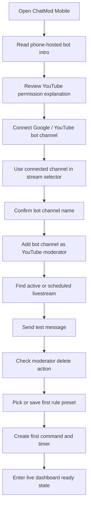
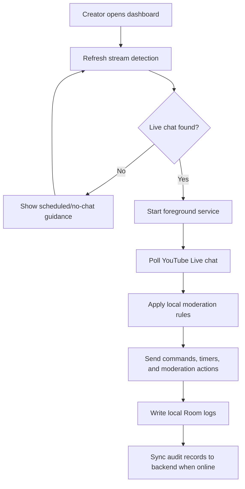
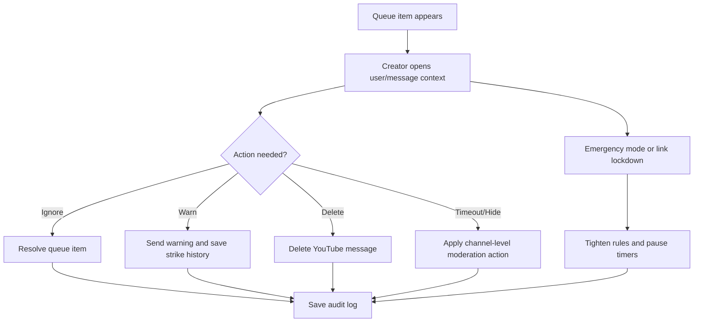
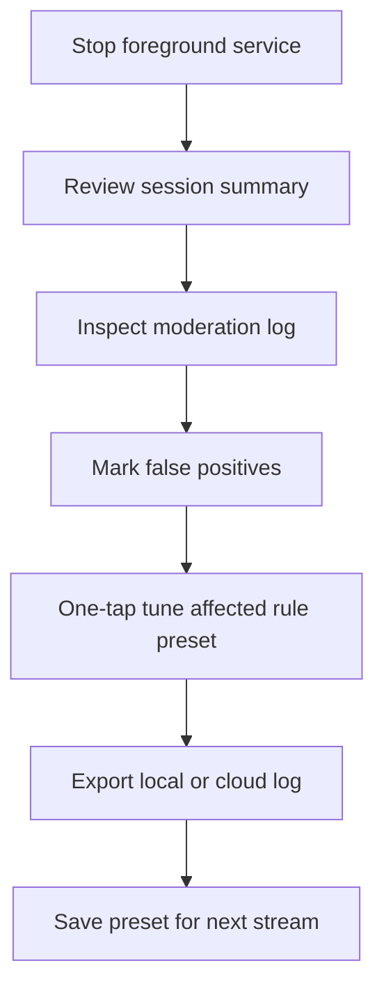
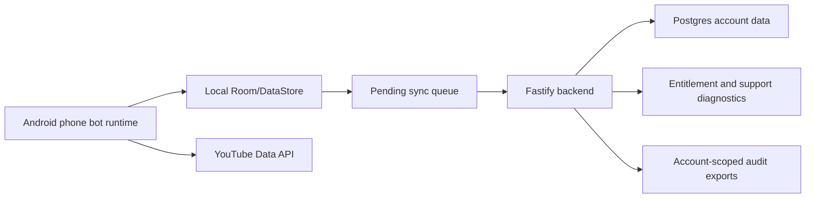

# User Flows

ChatMod Mobile uses a dashboard-first onboarding model. The first screen stays useful: creators see live status, setup progress, and direct actions instead of a marketing intro.

## New Creator Setup

## Going Live

## High-Pressure Moderation

## After Stream

## Backend Ownership Boundaries

